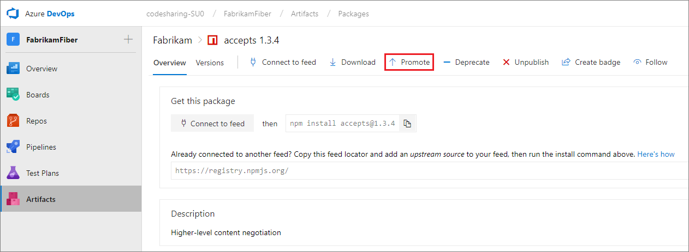
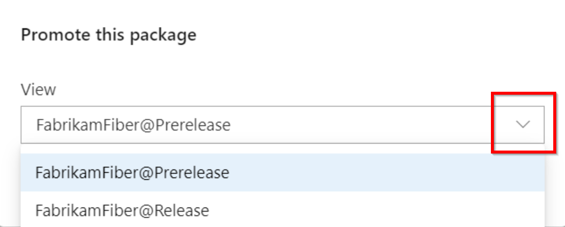

 

# Communicate package quality with prerelease and release views

**Azure DevOps Services**

Feeds are organizational containers that allow users to group packages and control who can access them by modifying the feed permissions.

A feed view on the other hand is a way to enable users to share some packages while keeping others private. Views filter the feed to a subset of packages that meet criteria defined by that view.

There are 3 types of views: `@local`, `@Prerelease` and `@Release`. The latter two are suggested views that you can rename or delete as desired. Those views contain a subset of the feed's packages that have been *promoted* into that specific view. All views currently support NuGet, npm, Maven, Python, and Universal packages.

*If you've never used feed views, read more about [why and how they're useful for package continuous integration and delivery](../concepts/views.md) before getting started.*

## Get started with feed views

By default, every feed has three types of views: `local`, `Prerelease`, and `Release` view.

### Promoting to a prerelease or release view 
To promote a package-version:

1. Select the package
1. Select the **Promote** button
1. Select the view to promote to and select **Promote**

> [!div class="mx-imgBorder"]
> 
> [!div class="mx-imgBorder"]
> 

You can also promote a package to a view using the REST API. Azure Artifacts currently supports NuGet, Python, npm, Maven (limited operations) and Universal packages.

* **Promote a NuGet package**

Example:

```HTTP
PATCH https://pkgs.dev.azure.com/{organization}/{project}/_apis/packaging/feeds/{feedId}/nuget/packages/{packageName}/versions/{packageVersion}?api-version=5.1-preview.1
```

See [NuGet - Update Package Version](https://docs.microsoft.com/rest/api/azure/devops/artifactspackagetypes/nuget/update%20package%20version?view=azure-devops-rest-5.1) for more details.

* **Promote an npm package**

Example:

```HTTP
PATCH https://pkgs.dev.azure.com/{organization}/_apis/packaging/feeds/{feedId}/npm/{packageName}/versions/{packageVersion}?api-version=5.1-preview.1
```

See [Npm - Update Package](https://docs.microsoft.com/rest/api/azure/devops/artifactspackagetypes/npm/update%20package?view=azure-devops-rest-5.1) for more details.

* **Promote a Python package**

Example:

```HTTP
PATCH https://pkgs.dev.azure.com/{organization}/{project}/_apis/packaging/feeds/{feedId}/pypi/packages/{packageName}/versions/{packageVersion}?api-version=5.1-preview.1
```

See [Python - Update Package Version](https://docs.microsoft.com/rest/api/azure/devops/artifactspackagetypes/python/update%20package%20version?view=azure-devops-rest-5.1) for more details.


* **Promote a Universal package**

Example:

```HTTP
PATCH https://pkgs.dev.azure.com/{organization}/_apis/packaging/feeds/{feedId}/upack/packages/{packageName}/versions/{packageVersion}?api-version=5.1-preview.1
```

See [Universal - Update Package Version](https://docs.microsoft.com/rest/api/azure/devops/artifactspackagetypes/universal/update%20package%20version?view=azure-devops-rest-5.1) for more details.

Keep in mind that you cannot publish a package directly to a view (for example, `nuget.exe publish -Source ...feed@view/nuget/...`). Instead, you should publish the package to your feed then promote it to a view. 

> [!NOTE]
> Package demotion is not supported currently. If you want this feature to be added to future releases, please feel free to **Suggest a feature** on our [Azure DevOps Developer Community](https://developercommunity.visualstudio.com/spaces/21/index.html).

<!-- TODO REST API link -->

## Managing views

You can create your own views or rename and delete existing ones in the feed settings dialog.

[!INCLUDE [edit-feed](../includes/edit-feed.md)]

In the feed settings view:
- Select **Views**
- Make your changes (Add view, Edit, or Delete)
- Select **Ok**

> [!div class="mx-imgBorder"]
> 

[!INCLUDE [feedback](../../includes/help-support-shared.md)]