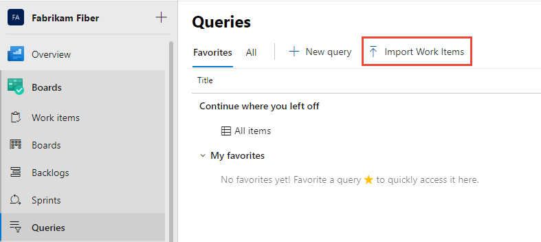
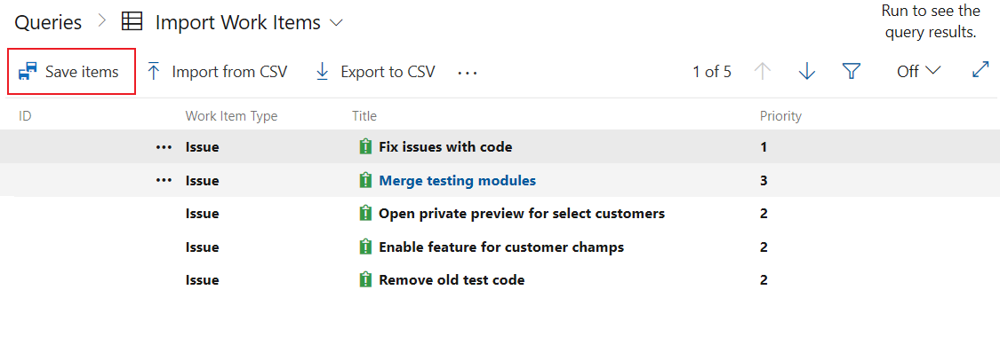
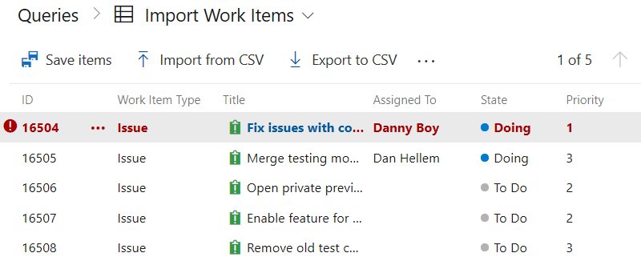

# Bulk import or update work items using CSV files

[!INCLUDE [temp](../includes/version-vsts-plus-azdevserver-2019.md)]

::: moniker range="azure-devops"

You can perform bulk import and export of work items using a CSV formatted file. While you can continue to use Excel for bulk import and updates, you can use the native import/export feature that doesn't require Excel. To learn more about using Excel, see [Bulk add or modify work items with Excel](../backlogs/office/bulk-add-modify-work-items-excel.md).

::: moniker-end 

::: moniker range="azure-devops-2019"

You can perform bulk export of work items using a CSV formatted file. While you can continue to use Excel for bulk import and updates, you can use the native export feature from Queries that doesn't require Excel. To learn more about using Excel, see [Bulk add or modify work items with Excel](../backlogs/office/bulk-add-modify-work-items-excel.md).

::: moniker-end 

> [!NOTE]   
> The export feature is available with [Azure DevOps Server 2019 Update 1](https://go.microsoft.com/fwlink/?LinkId=2097609) and later versions. The import feature is only available with Azure DevOps Services. 

::: moniker range="azure-devops"

## Import new work items

All work items you import are created in a new state. This rule means that you can't specify field values that don't meet the field rules for the new state. For example, when you create a new user story with the Agile process, the State=New and the Reason=New. No other values can be specified.

1. Create a local ***import.csv*** file and open it in Visual Studio Code or Excel.

2. The file must contain the **Work Item Type** and the **Title** fields. You can include other columns as needed. In the following example, we include the Priority field.

   > [!div class="tabbedCodeSnippets"]
   ```CSV
   Work Item Type,Title,Priority
   Issue,Fix issues with code,1
   Issue,Merge testing modules,3
   Issue,Open private preview for select customers,2
   Issue,Enable feature for customer champs,2
   Issue,Remove old test code,2
   ```

3. From the web portal for your project, open **Boards>Queries** and choose the **Import Work Items** option.

	> [!div class="mx-imgBorder"]  
	> 

4. Select your CSV file and then choose **Import**.

	> [!div class="mx-imgBorder"]  
	> 

5. The import process loads the imported work items into the queries view in an **unsaved** state. Verify the results are what you want. Choose **Save Items** to save the work items.

	> [!div class="mx-imgBorder"]  
	> 

6. The system highlights those work items with data issues. You need to resolve the data issues before you can save the work items. In this example, an invalid value has been entered into the Priority field. Fix the data by opening the work item directly. Alternatively, use [bulk edit](../backlogs/bulk-modify-work-items.md) to fix several work items with the same issue.

	> [!div class="mx-imgBorder"]  
	> 

> [!NOTE]   
> You can add parent-child links between work items you import by indenting the title columns as shown in the example later in this article, [Can I import a CSV file that have parent-child links?](#tree-items). However, you can't specify any other link types when importing or updating work items.  

## Update existing work items

1. To update work items, create a query that contains all the columns you want to export and possibly edit. Save your query and select **Export to CSV** to save the data.csv file to your local machine.

	> [!div class="mx-imgBorder"]  
	> 

   The exported file should look similar to the following syntax:

  > [!div class="tabbedCodeSnippets"]
   ```CSV
   ID,Work Item Type,Title,Assigned To,State,Priority,Tags
   "16504","Issue","Fix issues with code",,"To Do","1",
   "16505","Issue","Merge testing modules",,"To Do","3",
   "16506","Issue","Open private preview for select customers",,"To Do","2",
   "16507","Issue","Enable feature for customer champs",,"To Do","2",
   "16508","Issue","Remove old test code",,"To Do","2",
   ```

2. Make the edits to your work items. Your CSV file must contain the **ID**, **Work Item Type**, **Title**, and **State** fields. Any additional fields you want to include are optional.

   In the following example we change several values on existing working items.

  > [!div class="tabbedCodeSnippets"]
   ```CSV
   ID,Work Item Type,Title,Assigned To,State,Priority,Tags
   "16504","Issue","Fix issues with code",Dan Hellem,"Doing","1","Bug; High Priority"
   "16505","Issue","Merge testing modules",Dan Hellem,"Doing","3",
   "16506","Issue","Open private preview for select customers",,"To Do","2",
   "16507","Issue","Enable feature for champs and top customers",,"To Do","2",
   "16508","Issue","Remove old test code",,"To Do","3",
   ```

3. Save the file and import (see steps 4-6 from the previous import section.)

4. The results list with work items that contain value changes appear highlighted in bold. Choose **Save Items** to apply the changes.

	> [!div class="mx-imgBorder"]  
	> 

5. Work items with data issues are highlighted in red and need to be resolved before you can save them. In this example, an invalid value appears in the Assigned To field. Fix the data by opening the work item directly. Alternatively, you can use bulk edit if you have many work items with the same issue.

	> [!div class="mx-imgBorder"]  
	> 

::: moniker-end 


::: moniker range=">= azure-devops-2019"

## Export list as CSV 

From any query, you can export a list of work items as a comma-delimited list. Simply [open the query](view-run-query.md), choose the  actions icon, and choose **Export to CSV**.

::: moniker-end

::: moniker range="azure-devops-2019"

> [!NOTE]   
> Requires Azure DevOps Server 2019 Update 1 or later version. 

::: moniker-end

::: moniker range=">= azure-devops-2019"

> [!div class="mx-imgBorder"]  
>    

::: moniker-end 

::: moniker range="azure-devops"

## Q & A

### Can I import new items and update existing items in the same CSV file?

Absolutely! Leave the ID field empty for any new work items. In the following example, the last entry for an Epic doesn't specify an ID.

> [!div class="tabbedCodeSnippets"]
```CSV
ID,Work Item Type,Title,Assigned To,State,Priority,Tags
"16504","Issue","Fix issues with code",,"To Do","1",
"16505","Issue","Merge testing modules",,"To Do","3",
"16506","Issue","Open private preview for select customers",,"To Do","2",
"16507","Issue","Enable feature for customer champs",,"To Do","2",
"16508","Issue","Remove old test code",,"To Do","2",
,"Epic","Track Telementry for data imports",,"To Do","2",
```

<a id="tree-items" /> 

### Can I import a CSV file that have parent-child links?

Yes, you can add child work items by indenting title columns. The following example add three child Issues under the already defined Epic.

> [!div class="tabbedCodeSnippets"]
```CSV
ID,Work Item Type,Title 1,Title 2,Assigned To,State,Priority,Tags
"165","Epic","Track Telementry for data imports",,,"To Do","2",
,"Issue",,"Fix issues with code",,"To Do","1",
,"Issue",,"Open private preview for select customers",,"To Do","2",
,"Issue",,"Enable feature for customer champs",,"To Do","2",
```

Here is a better visual in Excel

> [!div class="mx-imgBorder"]  
> 

### How do I know if my imported file has errors?

Any problems with the formatting of your CSV file appear in the Results page of the import view. You can't import the work items until the formatting and syntax is correct.

> [!div class="mx-imgBorder"]  
> 

The work items results always lists the data errors found for individual work items. Fix each error either from the web portal, or in the CSV file and import again.


::: moniker-end 


## Related articles

- [Bulk add or modify work items with Excel](../backlogs/office/bulk-add-modify-work-items-excel.md)
- [FAQs: Work in Excel connected to Azure Boards](../backlogs/office/faqs.md)