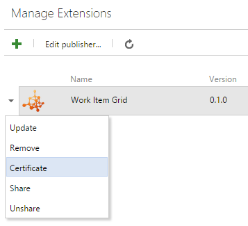

# Auth and security

[!INCLUDE [version-tfs-2017-through-vsts](../../includes/version-tfs-2017-through-vsts.md)]

> [!NOTE]
> This page pertains only to _web extensions_, and not Pipelines task extensions or service endpoint extensions. For those tasks, you can use the [Publish to Azure Service Bus Task](../../pipelines/tasks/utility/publish-to-azure-service-bus.md).

[!INCLUDE [extension-docs-new-sdk](../../includes/extension-docs-new-sdk.md)]

## Calling REST APIs from your extension

Most extensions have a need to call Azure DevOps REST APIs on behalf of the current user. 
* If you are using the provided `JavaScript REST clients`, authentication is automatically handled for you. These clients automatically request an access token from the core SDK and set it in the Authorization header of the request.
* If you are not using the provided clients, you need to request a token from the `Core SDK` and set it in the Authorization header of your request:

    ```javascript
    VSS.require(["VSS/Authentication/Services"],
        function (VSS_Auth_Service) {
            VSS.getAccessToken().then(function(token){
                // Format the auth header
                var authHeader = VSS_Auth_Service.authTokenManager.getAuthorizationHeader(token);
                
                // Add token as an Authorization header to your request
            });
        });
    ```

## Authenticating requests to your service

A common scenario is to make calls to a back-end service from an extension. To verify these calls are coming from your extension running in Azure DevOps and to verify the authenticity of the current user (and other context information), a special type of token is made available to your extension. This token contains information about who is making the call and also a signature that you can validate to know that the request came from your extension. 

### Get your extension's key

Your extension's unique key (which is generated when the extension is published) can be used to verify the authenticity of requests made from your extension.

To get this key, right-click a [published extension](../publish/overview.md) and select **Certificate**.



> [!WARNING]
> Scope changes in an extension cause the certificate to change. If you make changes to the scope, you need a new extension key.

### Generate a token to provide to your service

1. The Core SDK `getAppToken` method return a promise that, when resolved, contains a token signed with your extension's certificate.

    ```javascript
    VSS.getAppToken().then(function(token){
        // Add token to your request
    });
    ```

2. Pass this token to your service as a query parameter or request header.

### Parse and validate the token

Here is a sample of parsing the token.  First download and store the secret for your extension.  You can get this from your publisher page.  This secret needs to be available to your application.

#### .NET Framework

You must add 1 reference to get this sample to compile.

1. Open the NuGet Package Manager and add a reference to *System.IdentityModel.Tokens.Jwt*. This sample was built with version 5.2.2 of this package.

```csharp
using System.Collections.Generic;
using System.ServiceModel.Security.Tokens;
using Microsoft.IdentityModel.Tokens;

namespace TokenSample
{
	class Program
	{
		static void Main(string[] args)
		{
			string secret = ""; // Load your extension's secret
			string issuedToken = ""; // Token you are validating
				
			var validationParameters = new TokenValidationParameters()
			{
				IssuerSigningKey = new SymmetricSecurityKey(System.Text.UTF8Encoding.UTF8.GetBytes(secret)),
				ValidateIssuer = false,
				RequireSignedTokens = true,
				RequireExpirationTime = true,
				ValidateLifetime = true,
				ValidateAudience = false,
				ValidateActor = false
			};

			SecurityToken token = null;
			var tokenHandler = new JwtSecurityTokenHandler();
			var principal = tokenHandler.ValidateToken(issuedToken, validationParameters, out token);
		}
	}
}
```

#### .NET Core - WebAPI

You must add 1 reference to get this sample to compile.

1. Open the NuGet Package Manager and add a reference to *System.IdentityModel.Tokens.Jwt*. This sample was built with version 5.1.4 of this package.

**Startup.cs**

```csharp
using System.Text;
using Microsoft.AspNetCore.Authentication.JwtBearer;
using Microsoft.AspNetCore.Builder;
using Microsoft.AspNetCore.Hosting;
using Microsoft.Extensions.Configuration;
using Microsoft.IdentityModel.Tokens;

namespace TokenSample.Core.API
{
    public class Startup
    {
        public Startup(IConfiguration configuration)
        {
            Configuration = configuration;
        }

        public IConfiguration Configuration { get; }

        public void ConfigureServices(IServiceCollection services)
        {
            services.AddMvc();

            string _secret = "ey9asfasdmax..<the secret key downloaded from the Azure DevOps Services publisher page>.9faf7eh";
	    
            services.AddAuthentication(JwtBearerDefaults.AuthenticationScheme)
                    .AddJwtBearer((o) =>
                    {
                        o.TokenValidationParameters = new TokenValidationParameters()
                        {
                            IssuerSigningKey = new SymmetricSecurityKey(Encoding.UTF8.GetBytes(_secret)),
                            ValidateIssuer = false,
                            ValidateAudience = false,
                            ValidateActor = false,
                            RequireSignedTokens = true,
                            RequireExpirationTime = true,
                            ValidateLifetime = true
                        };    
                    });
        }

        public void Configure(IApplicationBuilder app, IHostingEnvironment env)
        {
            app.UseAuthentication();
            app.UseMvc();
            app.UseStaticFiles();
        }
    }
}
```

**Your API Controllers:**

```csharp
[Route("api/[controller]"), 
 Authorize()]
public class SampleLogicController : Controller
{
   // ...
}
```

