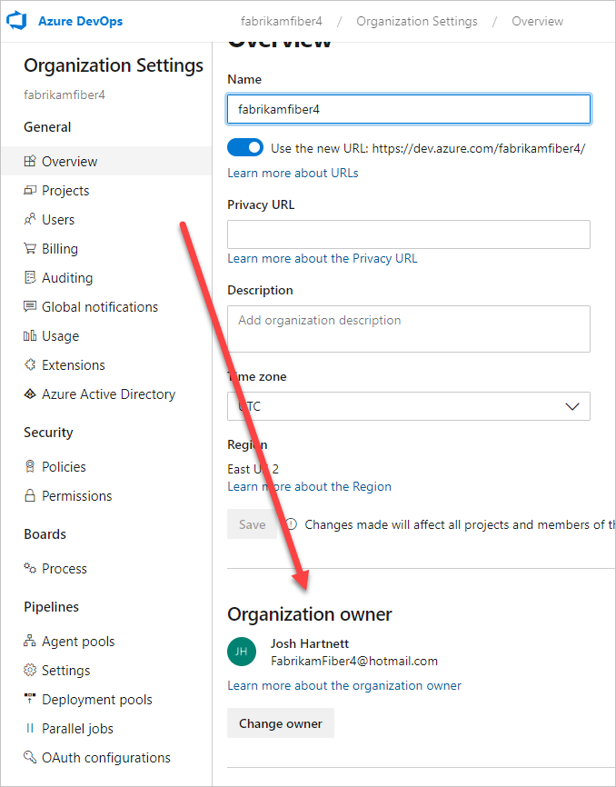

# FAQs - getting extensions for Azure DevOps

[!INCLUDE [version-vsts-tfs-2015-on](../boards/includes/version-vsts-tfs-2015-on.md)]

In this article, find frequently asked questions and answers about getting extensions for Azure DevOps. Included are FAQs about installing, requesting, assigning, and accessing extensions. You can also find [links to get support](#q-how-do-i-get-support-for-the-marketplace).

::: moniker range="azure-devops"

### Q: Who can install extensions for Azure DevOps?

A: The organization Owner and Project Collection Administrator can install extensions. If you don't have permissions, but you're an organization member,
you can [request extensions](request-extensions.md) instead.

<a name="find-owner"></a>

### Q: How do I find the organization Owner?

If you have at least Basic access, you can find the current owner in your organization settings.

1. Go to your **Organization settings**.

      

2. Find the current owner.

      

<a name="no-organizations"></a>

[!INCLUDE [no-organizations](../organizations/billing/includes/qa-no-organizations.md)]

### Q: Why can't I install extensions for Azure DevOps?

A: You can't install extensions for one of the following reasons.

<a name="no-permissions"></a>
*    You must have [Project Collection Administrator or organization Owner permissions](../organizations/security/lookup-organization-owner-admin.md).
If you don't have permissions, but you're an organization member, you can [request extensions](request-extensions.md) instead.

<a name="no-assignment"></a>
*    If you get an "already installed or requested" error check with your Project Collection Administrator
or organization Owner, and ask them to assign the extension to you.

::: moniker-end

::: moniker range="<= azure-devops-2019"

<!-- BEGINSECTION class="m-qanda" -->

<a name="difference"></a>

### Q: How do I get other help or support for Azure subscriptions and billing?

A: Check these [articles about Azure billing and subscriptions](https://azure.microsoft.com/documentation/articles/?tag=billing),
the [Azure Billing and Subscription FAQ](https://azure.microsoft.com/documentation/articles/billing-subscription-faq/),
or try [Azure Support](https://azure.microsoft.com/support/options/).

[!INCLUDE [what-happened-preview-extensions](../includes/qa-what-happened-preview-extensions.md)]

<!-- ENDSECTION -->

<!-- BEGINSECTION class="m-qanda" -->

<a name="no-install"></a>

### Q: Why can't I install extensions for TFS?

A: You can't install extensions for TFS for one of the following reasons:

* You must be a member of the [Project Collection Administrators group](../organizations/security/set-project-collection-level-permissions.md)
with [**Edit collection-level information** permissions](../organizations/security/permissions.md#collection) in the project collection where you want to install extensions. If you don't have permissions, you can [request extensions](./how-to/request-tfs-extensions.md) instead.

* If you get an error that your extension is already installed or requested, check with your Project Collection Administrator and ask them to assign the extension to you.

    <!-- image placeholder -->

<a name="no-team-project collection"></a>

### Q: Why don't I see the project collection I want?

A: You must be a member of your project collection.
Follow these steps to check your identity that you use
to sign in to the Marketplace.

1. On your TFS web portal home page (```https://{server}:8080/tfs/```),
   go to the top-right corner of the page, and select your user name to view your profile.
2. On the left side of your profile, make sure that your email address and directory are correct.
3. Close all browser windows.
4. Open a private or incognito browsing session.
5. Sign in to your TFS home page (```https://{server}:8080/tfs/```)
   with the identity that's a user in the project collection
   where you want to install the extension.

   > If you're asked to choose "work or school organization" or
   > "personal account", this means you used an email address
   > that's the same for a Microsoft account and a "work or school account"
   > that's managed by your organization in Azure Active Directory.
   > Although these identities have the same email address,
   > they're still separate identities with different profiles,
   > security settings, and permissions.
   >
   > Choose the identity that's the user in your project collection.

6. From your project collection, go to the Marketplace.

<a name="no-download"></a>

### Q: Why doesn't the extension that I want show a download button?

A: Some extensions work only with Azure DevOps, not TFS, for one of the following reasons:

- The extension uses Azure DevOps features that aren't released yet for TFS.
- The [extension manifest](../extend/develop/manifest.md) indicates that the extension
is available only for Azure DevOps Services (targets = Microsoft.Visualstudio.Services.Cloud).
- The extension manifest indicates that the extension is an integration (targets = Microsoft.Visualstudio.Services.Integration).

<a name="no-upload"></a>

### Q: Why can't I upload extensions to TFS?

A: You must be a member of the
[Team Foundation Administrators group](/azure/devops/server/admin/add-administrator#add-a-user-to-the-server-administrators-group). You must also have [**Edit instance-level information** permissions](../organizations/security/permissions.md#server)
for the Team Foundation Server where you want to upload extensions.

<a name="extension-access"></a>

[!INCLUDE [no-access-extension-features](../includes/qa-no-access-extension-features.md)]

<!-- ENDSECTION -->

<a name="get-support"></a>

[!INCLUDE [marketplace-support](includes/qa-marketplace-support.md)]

::: moniker-end

### Q: How do I get support for the Marketplace?

A: Depending on the support you need, choose from the following links:

* Billing questions - [Azure billing support](https://portal.azure.com/#blade/Microsoft_Azure_Support/HelpAndSupportBlade)
* Visual Studio subscriptions - [subscriptions support](https://visualstudio.microsoft.com/subscriptions/support)
* Help with Azure DevOps - [Azure DevOps support](https://azure.microsoft.com/support/devops/)
* Help with Team Foundation Server - [TFS support](https://visualstudio.microsoft.com/team-services/tfs_support)
* General Marketplace help - [Contact the Marketplace team](mailto:vsmarketplace@microsoft.com)

## Related articles

- [Azure DevOps billing overview](../organizations/billing/overview.md)
- [Azure DevOps billing FAQ](../organizations/billing/billing-faq.md)
- [How to pay for TFS users](../organizations/billing/buy-access-tfs-test-hub.md)
- [How to buy Visual Studio cloud subscriptions](/visualstudio/subscriptions/vscloud-overview)
- [Visual Studio cloud subscription billing FAQ](/visualstudio/subscriptions/vscloud-billing-faq)
