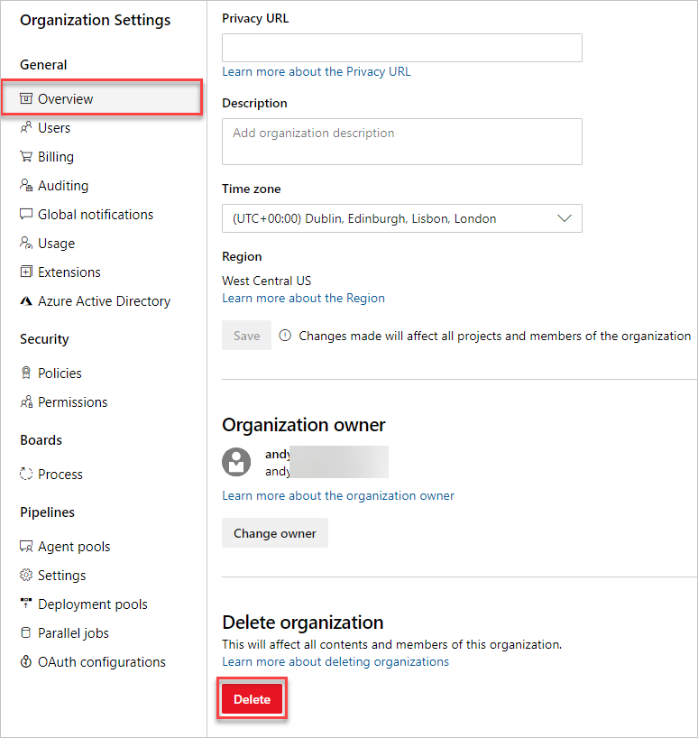
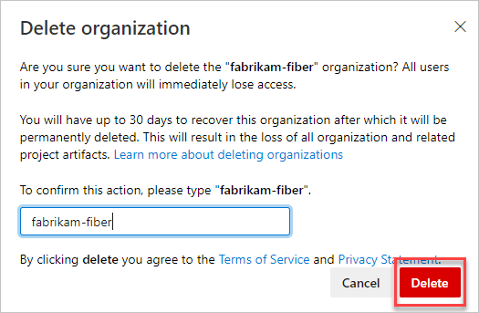

# Delete your organization

[!INCLUDE [version-vsts-only](../../includes/version-vsts-only.md)]

When you no longer need an organization, you can delete it from Azure DevOps. If you change your mind within 28 days, you can [recover your organization](recover-your-vsts-organization.md).
After 28 days, your organization and data are permanently deleted.

When you delete your organization, note the following occurrences:

* All users lose access to organization services and resources immediately.

* Your organization URL becomes available for anyone to use. (It might take up to one hour before your organization URL becomes available again.)

* Your organization is disabled, and appears deleted in your profile for 28 days.

* If your organization is linked to an Azure subscription for billing purchases, you must unlink your organization before you delete your organization.

  You're still charged for any paid users and services used during this billing cycle. Billing stops after the current cycle ends.

To delete your organization, you need Project Collection Administrator permissions. [How do I find the Project Collection Administrators?](../security/lookup-organization-owner-admin.md#show-members-of-the-project-collection-administrators-group)

## Prerequisites

If your organization uses an Azure subscription to bill purchases, you must [first remove billing from your organization](../billing/change-azure-subscription.md#remove-your-subscription) before you can delete your organization in Azure DevOps.

## Delete organization

To delete your organization, you need at least Basic access and Project Collection Administrator
permissions. [How do I find the Project Collection Administrators?](../security/lookup-organization-owner-admin.md#show-members-of-the-project-collection-administrators-group)

1. Sign in to your organization (```https://dev.azure.com/{yourorganization}```).

2. Select  **Organization settings**.

    


3. Select **Overview** > **Delete**.

   

4. In the resulting dialog box, enter the name of the organization, and then select **Delete**.

   

5. To review your organizations, go to your [Visual Studio profile](https://app.vsaex.visualstudio.com/profile/view), where you can see your deleted organization.

   [Need help?](faq-configure-customize-organization.md#get-support)

Your organization is deleted.

## Related articles

- [Recover your deleted organization](recover-your-organization.md)
- [Resolve an orphaned organization](resolve-orphaned-organization.md)
- [Create a new organization](create-organization.md)

