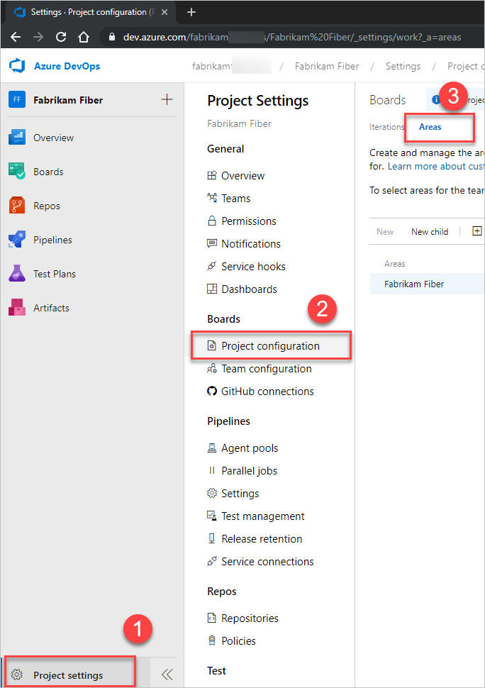
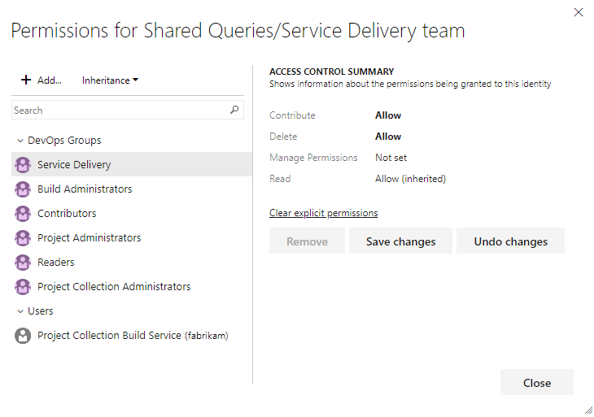
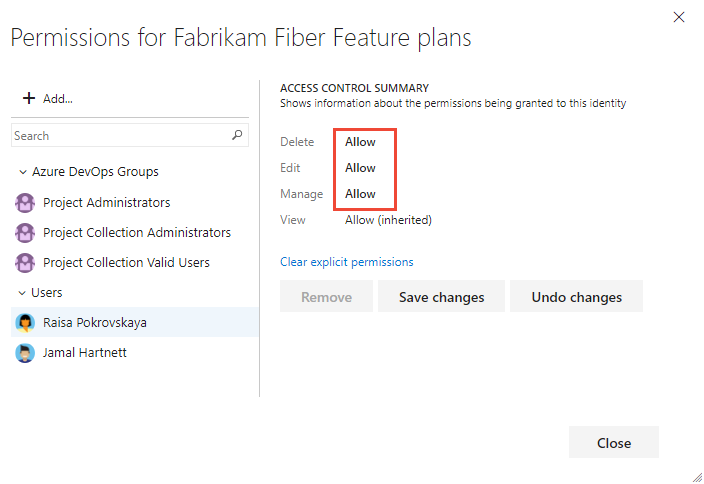

:::row:::
   :::column span="1":::
      **Role or permission level**
   :::column-end:::
   :::column span="2":::
      **Functional areas set**
   :::column-end:::
:::row-end:::
---
:::row:::
   :::column span="1":::
      **Team administrator role**  
      To add a user to the team administrator role, see [Add a team administrator](../../organizations/settings/add-team-administrator.md).
   :::column-end:::
   :::column span="2":::
      - [Manage teams and configure team tools](../settings/manage-teams.md)  
      - [Define and edit team dashboards](../../report/dashboards/dashboards.md)  
      - [Add and manage team-level work item templates](../../boards/backlogs/work-item-template.md) 
      - [Add team administrators](../settings/add-team-administrator.md) 
   :::column-end:::
:::row-end:::
---
:::row:::
   :::column span="1":::
      **Object-level permissions**
   :::column-end:::
   :::column span="2":::
      ::: moniker range=">= tfs-2017"
      - [Modify work items under an area path](#set-permissions-area-path) 
      - [Create and edit nodes under an area path or iteration path](#set-permissions-area-path) 
      - [Define and edit queries or query folders](#work-item-queries) 
      - [Define and edit Delivery Plans](../../boards/plans/edit-delivery-plan-permissions.md)  
      ::: moniker-end
      ::: moniker range="< tfs-2017"
      - [Modify work items under an area path](#set-permissions-area-path) 
      - [Create and edit nodes under an area path or iteration path](#set-permissions-area-path) 
      - [Define and edit queries or query folders](#work-item-queries)  
      ::: moniker-end
   :::column-end:::
:::row-end:::
---
:::row:::
   :::column span="1":::
      **Project-level permissions**
   :::column-end:::
   :::column span="2":::
      ::: moniker range=">= azure-devops-2020"
      - [Create work item tags](../../boards/queries/add-tags-to-work-items.md) 
      - [Move work items out of a project](#move-delete-permissions) 
      - [Permanently delete work items](#move-delete-permissions) 
      - [Edit shared work item queries](../../boards/queries/set-query-permissions.md)
      - [Add teams and team administrators](../settings/add-team-administrator.md))
      - [Edit project-level permissions](set-project-collection-level-permissions.md#project-level)  
      ::: moniker-end
      ::: moniker range="< azure-devops-2020"
      - [Create work item tags](../../boards/queries/add-tags-to-work-items.md) 
      - [Permanently delete work items](#move-delete-permissions) 
      - [Edit shared work item queries](../../boards/queries/set-query-permissions.md)
      - [Add teams and team administrators](../settings/add-team-administrator.md))
      - [Edit project-level permissions](set-project-collection-level-permissions.md#project-level)
      ::: moniker-end
   :::column-end:::
:::row-end:::
---
:::row:::
   :::column span="1":::
      **Project collection-level permissions**
   :::column-end:::
   :::column span="2":::
      ::: moniker range=">= azure-devops-2019"
      - [Create, delete, or edit a process (Inheritance process model)](#process-permissions)  
      - [Delete field from account (Inheritance process model)](set-project-collection-level-permissions.md#collection-level) 
      - [Manage process permissions (Inheritance process model)](set-project-collection-level-permissions.md#collection-level) 
      - [Edit collection level permissions](set-project-collection-level-permissions.md#collection-level)  Project collection-level permissions include all permissions you can set at the collection-level.
      ::: moniker-end
      ::: moniker range="< azure-devops-2019"
      - [Edit collection level permissions](set-project-collection-level-permissions.md#collection-level)  Project collection-level permissions include all permissions you can set at the collection-level.
      ::: moniker-end
   :::column-end:::
:::row-end:::
---
  

<a name="set-permissions-area-path" /> 

## Create child nodes, modify work items under an area path   

Area path permissions let you grant or restrict access to edit or modify work items, test cases, or test plans assigned to those areas. You can restrict access to users or groups. You can also set permissions for who can add or modify areas or iterations for the project.  

::: moniker range=">= azure-devops-2019" 

You define both areas and iterations for a project from the **Project Settings>Work>Project configuration**. 

1. Choose (1) **Project Settings**, expand **Work** if needed, and choose (2) **Project configuration** and then (3) **Areas**.   

    > [!div class="mx-imgBorder"]  
    >    

1. Choose the ... context menu for the node you want to manage and select **Security**.  

    

1. Select the group or team member, and then change the permission settings. If you don't see the group you want, try adding it first. 

    For example, here we've added the Disallow Access Group, and disallowed members of this group the ability to view, modify, or edit work items in the Customer Service area path.

      

    You can specify two explicit authorization states for permissions: **Deny** and **Allow**. In addition, permissions can exist in one of three additional states.  To learn more, see [Get started with permissions, access, and security groups](about-permissions.md). 

::: moniker-end

::: moniker range=">= tfs-2017 <= tfs-2018"  

1. From the web portal for the project, choose the :::image type="icon" source="../../media/icons/gear_icon.png" border="false"::: gear icon.  

    > [!div class="mx-imgBorder"]  
    > 

    If you're currently working from a team context, then hover over the  and choose **Project settings**.  

    > [!div class="mx-imgBorder"]
    >   

2. Choose **Work** and then **Areas**.  

1. Choose the ... context menu for the node you want to manage and select **Security**.  

    

::: moniker-end   

::: moniker range=">= tfs-2013 <= tfs-2015"  

1. From the web portal, choose the :::image type="icon" source="../../media/icons/gear_icon.png" border="false"::: gear icon to open project administration pages. Then choose **Areas**. 

    

1. Choose the context menu for the node you want to manage.  

      

2. Select the group or team member, and then change the permission settings. If you don't see the group you want, try adding it first. 

    For example, here we've added the Disallow Access Group, and disallowed members of this group the ability to view, modify, or edit work items in the Customer Service area path.

      

    You can specify two explicit authorization states for permissions: **Deny** and **Allow**. In addition, permissions can exist in one of three additional states.  To learn more, see [Get started with permissions, access, and security groups](about-permissions.md). 

::: moniker-end

## Set permissions on queries or query folders

You can specify who can add or edit query folders or queries at the object-level. 
To manage permissions for a query or query folder, you must be the creator of the query or folder, a member of the Project Administrators or Project Collection Administrators group, or granted explicit access through the object's Security dialog. 

**Query folder Permissions dialog**

> [!div class="mx-imgBorder"]  
> 

For details, see [Set permissions on a shared query or query folder](../../organizations/security/set-permissions-access-work-tracking.md). To learn more about queries, see [Create managed queries to list, update, or chart work items](../../boards/queries/about-managed-queries.md).

::: moniker range=">= tfs-2017"  

<a id="tags" /> 

## Set permissions on work item tags 

By default, all users of the Contributors group can create and add tags to work items. To set permissions for a group or user to restrict this ability, you can set the **Create tag definition** to **Deny** at the project-level. To learn how, see [Change the permission level for a project-level group](set-project-collection-level-permissions.md#project-level). 

::: moniker-end

::: moniker range=">= tfs-2017"  

## Edit or manage permissions for Delivery Plans 

Delivery Plans are an object within a project. You manage plan permissions for each plan similar to the way you manage permissions for shared queries or query folders. The creator of a Delivery Plan as well as all members of the Project Collection Administrators and Project Administrators groups have permissions to edit, manage, and delete plans. 

**Delivery Plan Permissions dialog**

> [!div class="mx-imgBorder"]  
> 

To learn more, see [Edit or manage Delivery Plan permissions](../../boards/plans/edit-delivery-plan-permissions.md). To learn more about Delivery Plans, see [Review team plans](../../boards/plans/review-team-plans.md).

::: moniker-end

::: moniker range=">= azure-devops-2019"  

## Move or permanently delete work items 

By default, Project Administrators and Contributors can change the work item type and delete work items by moving them to the **Recycle Bin**. Only Project Administrators can permanently delete work items and test artifacts. Project admins can grant permissions to other team members as needed. 

For example, as a project admin you can grant a user, team group, or other group you've created to have these permissions. Open the Security page for the project and choose the user or group you want to grant permissions. (To learn how to access project-level **Security**, see [Set permissions at the project-level or project collection-level](set-project-collection-level-permissions.md).)

> [!NOTE]   
> The **Move work items out of this project** permission requires the project uses the Inherited process model. 

In this example, we grant members assigned to the team administrator role, who belong to the Team Admin groups, permissions to move work items to another project and to permanently delete work items.   

> [!div class="mx-imgBorder"]  
>   

::: moniker-end    

::: moniker range=">= tfs-2017"

## Manage test plans and test suites

In addition to the project-level permissions set in the previous section, team members need permissions to manage test artifacts which are set for an area path. 

[Open the **Security** page for area paths](#set-permissions-area-path) and choose the user or group you want to grant permissions. 

  

Set the permissions for **Manage test plans** and **Manage test suites** to **Allow**.  

  

To have full access to the Test feature set, your [access level must be set to Basic + Test Plans](change-access-levels.md). Users with Basic access and with permissions to permanently delete work items and manage test artifacts can only delete orphaned test cases.  
::: moniker-end  

<a id="process-permissions" />

::: moniker range=">= azure-devops-2019"  

## Customize an inherited process 

By default, only Project Collection Administrators can create and edit processes. However, these admins can grant permissions to other team members by explicitly setting the **Create process**, **Delete process**, or **Edit process** permissions at the collection level for a specific user. 

To customize a process, you need to grant **Edit process**  permissions to a user account for the specific process. 

::: moniker-end  

::: moniker range="azure-devops"  

> [!NOTE]  
> Users added to the **Project-Scoped Users** group won't be able to access Process settings if the **Limit user visibility for projects** preview feature is enabled for the organization. To learn more, see [About projects and scaling your organization, Project-scoped Users group ](../projects/about-projects.md#project-scoped-user-group). 

::: moniker-end  

::: moniker range=">= azure-devops-2019"  

1. Open the &hellip; context menu for the inherited process and choose **Security**.  To open this page, see [Customize a project using an inherited process](../settings/work/customize-process.md).   

      

2. Add the account name of the person you want to grant permissions to, set the permissions to **Allow** that you want them to have, and then choose **Save changes**. 

    Here we add Christie Church and allow her to edit the process.  

        

> [!NOTE]     
> Each process is a securable unit and has individual access control lists (ACLs) that govern creating, editing, and deleting inherited processes.  At the collection level, project collection administrators can choose which processes can be inherited from and by whom. When you create a new inherited process, the process creator as well as project collection administrators have full control of the process and can also set individual ACLs for other users and groups to edit and delete the process.

::: moniker-end

::: moniker range="<= azure-devops-2019"  

## Additional options for restricting access to work items   

See [Restrict access, Restrict modification of work items based on a user or group](restrict-access.md#restrict-modifications-wits) for additional options for customizing work item types to support restrictions. 

::: moniker-end

## Related articles 

- [Grant or restrict access](restrict-access.md)  
- [Set permissions on queries and query folders](../../boards/queries/set-query-permissions.md)  
- [Permissions and access for work tracking](permissions-access-work-tracking.md) 
- [Permissions and groups reference](permissions.md) 
- [Delete and restore work items](../../boards/backlogs/remove-delete-work-items.md)  
- [Delete test artifacts](../../boards/backlogs/delete-test-artifacts.md#prerequisites) 
- [Work item form IndexDB caching issues](../settings/work/troubleshoot-work-item-form-caching-issues.md)  