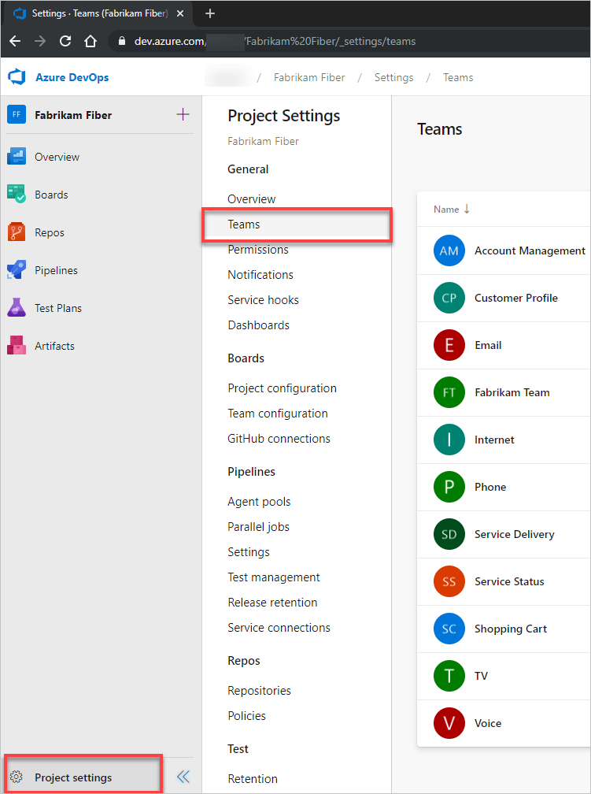
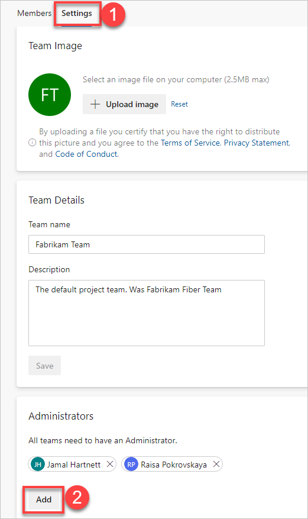
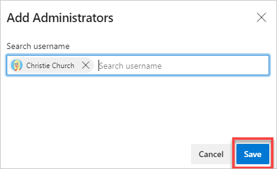
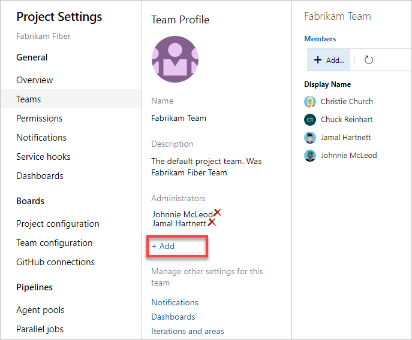
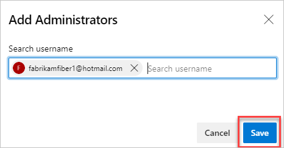
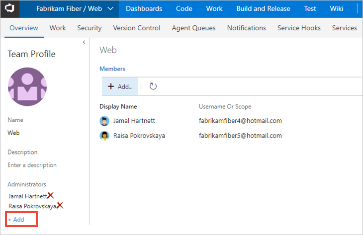
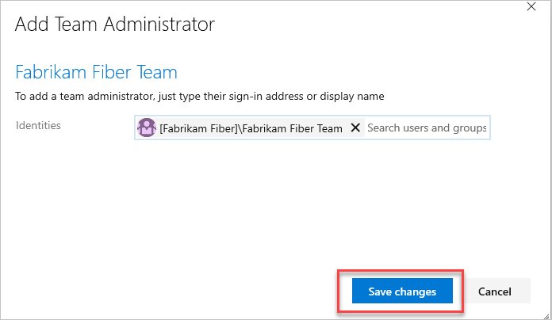
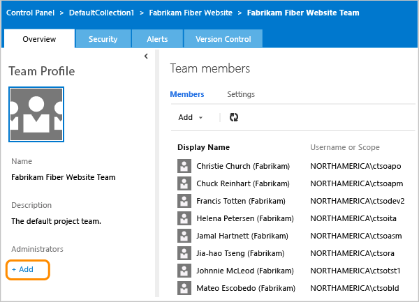

# Add or remove a team administrator 

[!INCLUDE [temp](../../includes/version-vsts-tfs-all-versions.md)]


<a id="add-team-admin">  </a>  

Learn how to add or remove an administrator for your team. It's always a good idea to have more than one user with administration permissions for a team. Team administrators can [manage teams and configure team tools](manage-teams.md) and manage projects. You may want to remove a user's administration permissions, for instance if the user is no longer active. 

<a name="permissions"></a>

## Prerequisites

::: moniker range="azure-devops"

- To add a user as a team administrator: 
	- You must be a member of a project. If you don't have a project yet, [create one](../projects/create-project.md).  
	- You must be a [member of the Project Administrators group](../security/set-project-collection-level-permissions.md), or a team administrator for the team you want to update.
- To be added as a team administrator, you must be granted **Basic** or higher access-level. Users granted Stakeholder access can't be added as a team administrator.
 
::: moniker-end

::: moniker range="< azure-devops"

- To add a user as a team administrator: 
	- You must be a member of a project. If you don't have a project yet, [create one](../projects/create-project.md).  
	- You must be a [member of the Project Administrators group](../security/set-project-collection-level-permissions.md), or a team administrator for the team you want to update.
- To be added as a team administrator, you must be granted **Basic** or higher access-level. Users granted Stakeholder access can't be added as a team administrator. 
::: moniker-end


To add a team, see [Add teams](add-teams.md).

<a id="open-admin-context">  </a>

## Add an administrator

To get added as a team administrator, ask another team administrator or a member of the [Project Administrators group](../security/set-project-collection-level-permissions.md) to add you.  

::: moniker range="azure-devops"

> [!NOTE]   
> To enable the user interface for the **New Teams Page**, see [Manage or enable features](../../project/navigation/preview-features.md).

::: moniker-end

#### [New Teams Page](#tab/preview-page) 

::: moniker range="azure-devops"

1. Sign in to your organization (```https://dev.azure.com/{yourorganization}```) and select a project.
2. Choose **Project settings**, and then choose **Teams**. 
    
	> [!div class="mx-imgBorder"]
    > 

3. Select the team to configure, and then select **Settings** > **Add**. 

	> [!div class="mx-imgBorder"]
	>   

3. Enter the user's identity you want to add to the administrator role, and then select **Save**.     
	    
	> [!div class="mx-imgBorder"]
	> 

::: moniker-end
 
[!INCLUDE [temp](../../includes/note-new-teams-not-supported.md)]  

#### [Current page](#tab/current-page) 

::: moniker range=">= azure-devops-2019"

1. Choose **Project settings**, and then choose **Teams**. 

	> [!div class="mx-imgBorder"]
    > 

2. Select the team to configure, and then select **Settings** > **Add**. 

	> [!div class="mx-imgBorder"]
	>   

3. Enter the user identity that you want to add to the administrator role, and then select **Save**.     
	    
	> [!div class="mx-imgBorder"]
	> 

::: moniker-end

::: moniker range=">= tfs-2017 <= tfs-2018"

1. From the web portal and team context, choose the :::image type="icon" source="../../media/icons/gear_icon.png" border="false"::: gear icon to open **Team Settings**.

	> [!div class="mx-imgBorder"]  
	> 

	If you choose the :::image type="icon" source="../../media/icons/gear_icon.png" border="false"::: gear icon from the project context, then choose **Overview**, and select the team you want to configure.   

2. Choose the **Add** link to open the dialog for adding user identities.  

	  
   
3. Enter the identities you want to add to the team administrator role.   

	> [!div class="mx-imgBorder"]
	> 
   
::: moniker-end     

::: moniker range=">= tfs-2013 <= tfs-2015"  

1. From the web portal, select your project, and then select the :::image type="icon" source="../../media/icons/gear_icon.png" border="false"::: gear icon to open the administration page.

	> [!div class="mx-imgBorder"]  
	> 

	If you choose the :::image type="icon" source="../../media/icons/gear_icon.png" border="false"::: gear icon from the project context, then choose **Overview**, and select the team you want to add an administrator to.   

2. Choose the **Add** link to open the dialog for adding user identities.    
  
	

3. Enter the identities you want to add to the team administrator role.     

	    
	
::: moniker-end  


* * *


<a id="remove-admin">  </a>

## Remove an administrator

Each team must have at least one administrator. To remove an administrator, you must first add at least a second administrator. 

Open the **Teams** settings page as described in the previous section.

#### [New Teams Page](#tab/preview-page) 

::: moniker range="azure-devops" 

1. Sign in to your organization (```https://dev.azure.com/{yourorganization}```) and select a project.
2. Choose **Project settings**.
3. On the **Overview** page, choose the  remove icon for the user you want to remove as a team administrator. 


::: moniker-end

[!INCLUDE [temp](../../includes/note-new-teams-not-supported.md)]  

#### [Current page](#tab/current-page) 

::: moniker range=">= azure-devops-2019"

From the Administrators section, choose the  for the user you want to remove as a team administrator. 

> [!div class="mx-imgBorder"]
>   

::: moniker-end
::: moniker range=">= tfs-2013 < azure-devops-2019"

From the Administrators section, choose the  for the user you want to remove as a team administrator. 

> [!div class="mx-imgBorder"]
> 

::: moniker-end
   
* * *
 
## Next steps  

> [!div class="nextstepaction"]
> [Manage teams and configure team tools](manage-teams.md) 

## Related articles

- [Add teams](add-teams.md)  
- [About teams & Agile tools](../../organizations/settings/about-teams-and-settings.md)
- [Configure and customize Azure Boards](../../boards/configure-customize.md)
- [Set team favorites](../../project/navigation/set-favorites.md)

