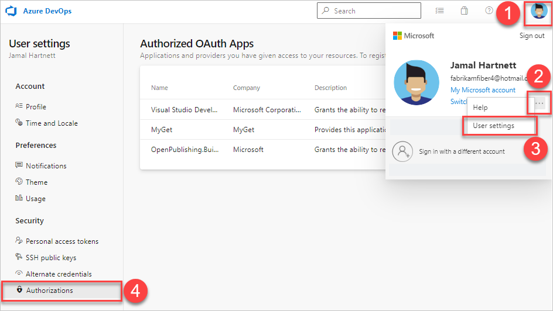

#  Authorize other services to access Azure DevOps

[!INCLUDE [temp](../../includes/version-vsts-plus-azdevserver-2019.md)]

When you use a service that's integrated with Azure DevOps Services, we use the industry-standard OAuth 2.0 authorization framework to provide safe, secure access to your resources by those other services. With OAuth, you grant a service the authorization to access your Azure DevOps resources such as work items, source code, and build results.

- Authorizations are bound to your credentials, so the service can use the authorization to access resources in any organization that you have access to.
- Use your Microsoft account (like ```me@live.com```) or your work account (your account in Azure AD - like ```me@my-workplace.com```) to authorize the service.
- The service that you authorize never has access to your Azure DevOps credentials.
- Revoke any authorizations that you've granted to other services.

## Authorize a service

A typical authorization flow might be similar to the following example:

1. You're using a service that uses Azure DevOps resources, so the service requests authorization.

2. If you're not already signed in, Azure DevOps prompts you for your credentials.
   
   

3. After you've signed in, you get the authorization approval page.

   

   Services can only request full access to all of the resources that are available to you through the REST APIs, so the authorization request may not be specific.

4. Review the request and approve the authorization.

5. The authorized service uses that authorization to access resources in your Azure DevOps organization.

To ensure an authorization request is legitimate, do the following actions:

- Look for the Azure DevOps branding across the top of the authorization approval page.

- Ensure the authorization approval page URL begins with ```https://app.vssps.visualstudio.com/```.

- Pay attention to any HTTPS-related security warnings in your browser.

- Remember that other services don't ask for your credentials directly. They let you provide them to Azure DevOps through the authorization approval page.

## Manage authorizations

View the services that you've authorized to access your organization. Go to **User settings**, and then select **Authorizations**. You can also go to [your profile view](https://app.vssps.visualstudio.com/Profile/View)
and follow the **Azure DevOps profile** link.



You can revoke any authorizations so the service can no longer access your organization on your behalf.
