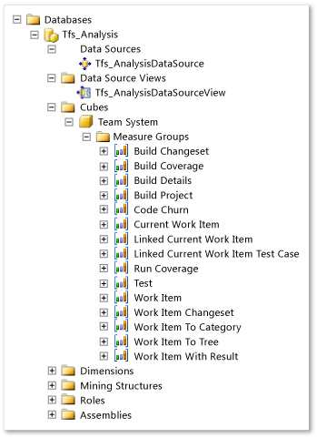

# Create and manage Reporting Services reports

[!INCLUDE [temp](../includes/tfs-report-platform-version.md)]

If you added SQL Server Reporting Services at installation, then your on-premises Team Foundation Server (TFS) deployment is configured with a data warehouse, SQL Server Analysis Services cube, and Reporting Services Reports. If you didn't add these services previously and want to add them now, see [Add a report server to your deployment](../admin/add-a-report-server.md?toc=/azure/devops/report/toc.json&bc=/azure/devops/report/breadcrumb/toc.json ).  
  
You can create or customize your own Reporting Services reports which support the following scenarios:  
  
- Allow users to update the report without granting them read access to the databases.  
- Share your reports in Team Explorer under the Reports folder.  
- Support subscriptions to reports that can be sent daily over email.  
- Manage the properties of your reports so that they return results faster and use fewer server resources.  
- Use Transact-SQL queries to retrieve the data for your reports.  

To learn more, see the following topics:  
- [Creating Reports for Team Foundation Server 2010](https://go.microsoft.com/fwlink/?LinkID=199478) describes how to create reports that you can view by using Report Manager. (There are only minor schema changes introduced for the TFS 2015 relational warehouse since TFS 2010).  
- [Customizing Reports for Team Foundation Server 2010](https://go.microsoft.com/fwlink/?LinkID=199479) describes how to customize the default reports for Reporting Services that are provided with each process template. These reports use queries that are written in either SQL or Multidimensional Expressions (MDX). (There are only minor schema changes introduced for the TFS 2015 cube since TFS 2010).  
- [Table reference for the relational warehouse database](table-reference-relational-warehouse-database.md). The warehouse contains data about builds, source code, test results and code coverage, and work items such as tasks and bugs. Data in the warehouse is collected from the operational stores and organized in a set of tables, views, and table-valued functions from which you can design reports. You can explore relationships between the integrated data sets by directly querying and creating reports from data that is stored in the relational warehouse database.  
  
     
  
- [Perspectives and measure groups provided in the Analysis Services cube](perspective-measure-groups-cube.md). The Team System cube  provides all metrics that are defined for all measure groups. By using the Analysis Services cube for TFS, you can generate reports of aggregated information about the data that is stored in team project collections. You can easily use this data to create PivotTable and PivotChart reports in Microsoft Excel.  
  
     
  
- [Reportable fields reference](../../reference/xml/reportable-fields-reference.md?toc=/azure/devops/report/toc.json&bc=/azure/devops/report/breadcrumb/toc.json). All data captured for work items is written to the WIT data store, but only select data is written to the Analysis Services data warehouse. The reportable attribute assigned to each work item field determines whether data is written to only the relational warehouse database or to both the relational warehouse and the OLAP cube. Reportable fields have their reportable attribute set to detail, dimension, or measure.  
  
## Tools for creating reports  

You can access both the relational data warehouse and the Analysis Services cube to create highly customized reports by using these authoring tools. 

- **Report Builder** is an intuitive environment for authoring reports. This application is optimized for Microsoft Office so that business users can work in that familiar environment. You can use Report Builder to work with data, define a layout, preview a report, and publish a report to a report server or a SharePoint site. This application includes a wizard for creating tables or charts, in addition to query builders and an expression editor. It also supports the advanced reporting features in SQL Server Reporting Services.   

You can download Report Builder for free from the following pages on the Microsoft web site:    
- **[Report Builder](/sql/reporting-services/install-windows/install-report-builder)** 
- **[Report Builder 2.0 (for SQL Server 2008](https://www.microsoft.com/download/details.aspx?id=24085)**
- **Report Designer** is a graphical interface for creating full-featured Reporting Services reports. After your report is finished, you have access to the full functionality for managing Reporting Services reports. To use Report Designer, you must know how to connect to and query a data source, but you do not have to know Report Definition Language (RDL).

   To use Report Designer, you must have Visual Studio and SQL Server Business Intelligence Development Studio.
   
   To learn more about how to work with the authoring tool, see these articles:
   
   - [Reporting Services Reports (SSRS)](/sql/reporting-services/reports/reporting-services-reports-ssrs)
   - [Reporting Services in SQL Server Data Tools (SSDT)](/sql/reporting-services/tools/reporting-services-in-sql-server-data-tools-ssdt)
   - [Design Reporting Services Paginated Reports with Report Designer (SSRS)](/sql/reporting-services/tools/design-reporting-services-paginated-reports-with-report-designer-ssrs)
   - [Comparing Report Authoring Environments](/previous-versions/sql/sql-server-2008-r2/dd220519(v=sql.105))   

 

##  Q & A  
  
### Q: How do I view and organize default Reporting Services reports?  

**A:**   See [Reporting Services Reports](reporting-services-reports.md).  
  
### Q: How do I upload a report?  

**A:** See [Upload reports](../admin/upload-reports.md).  
  
### Q: How do I manage report properties?  

**A:** After you create and publish reports, you can use Report Manager to view, organize, and configure those reports. By using Report Manager, you can group related reports in folders, adjust parameters and data sources, and schedule automated reports. See [View, organize, and configure reports using Report Manager](../admin/view-upload-organize-reporting-services-reports.md).
