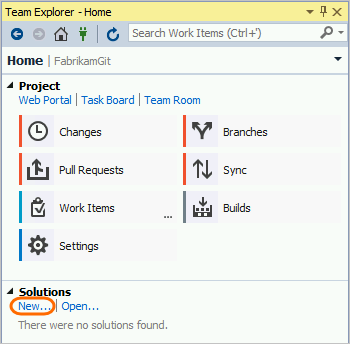
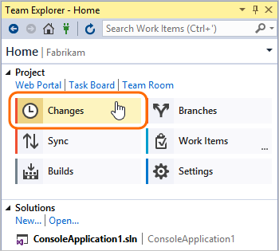
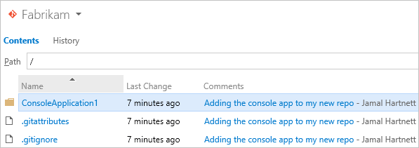
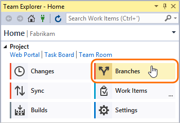
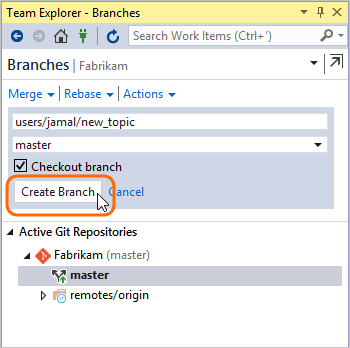
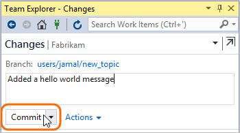
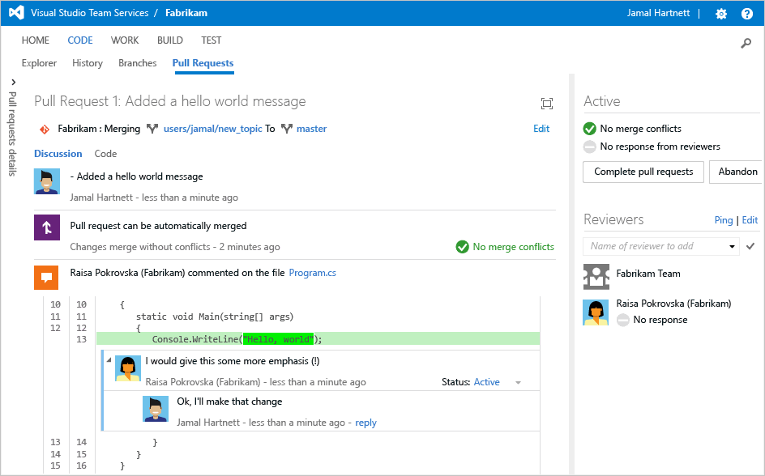

#  Get started using Git in Visual Studio

> [!div class="op_single_selector"]
> - [Visual Studio 2017](gitquickstart.md)
> - [Visual Studio 2015 Update 2](gitquickstart-vs2015.md)
> - [Visual Studio 2013 and Visual Studio 2015 RTM/Update 1](get-started-vs2013.md) 

#### Azure Repos | Azure DevOps Server 2019 | TFS 2018 | TFS 2017 | TFS 2015 

Whether your software project is large, small, or brand new, in most cases you'll be better off if you use version control as early as possible. 
Here, we'll show you how to get started with Git, a distributed version control system. 
If you want to work in a centralized version control system, you can instead use [Team Foundation Version Control](../../repos/tfvc/index.yml) (TFVC).

## Create a project for your repositories
Projects hold your repositories, backlogs, and builds.  When you create a project, a new repository will be automatically created for you.

If you don't already have a project [create a new project](#create_team_project)

## Install Git client tools
To use Git, you'll need to have the client tools installed on your computer.

[//]: # (Fix the 2015 link)
* Install [Visual Studio 2013](https://go.microsoft.com/fwlink/?LinkId=309297) or [Visual Studio 2015](https://visualstudio.microsoft.com/downloads/visual-studio-2015-downloads-vs)
* Or, if you're not using Visual Studio, [install the latest command line tools](https://git-scm.com/downloads) 

[//]: # (The walkthrough below shows the steps for getting started with Git using Visual Studio.  If you're not using Visual Studio, check out one of these topics:)
 
[//]: # (Get started using command line)
[//]: # (Using Git with Eclipse)

[//]: # (Update when new onboarding is in place) 
## Clone
To get started, you'll first need to clone your repo to your local machine.  Once you have a local clone, you can start adding code to your repo.

1. Go to your team's project page (`https://dev.azure.com/{yourorganization}/{yourteamproject}`) and then open Visual Studio to connect to your project.  Click **Allow** if prompted to open Visual Studio.

	

2. Sign in to Azure DevOps Services from Visual Studio.

3. Clone the repository to your computer.

	
	
4. The clone URL is automatically populated and a default local path is provided.  Change the local path to the location where you want to store your repo.  Click **Clone** to start copying the repo locally.

	  

## Add code to your repo
Let's add a new app to the repo so we can make some changes.

1. Create a new project in Visual Studio from the team explorer.

   

2. Create a new Console Application.  Notice that the location is set to the location on disk where the empty repo was cloned and the Add to source control option is checked.

	
	
3. In Team Explorer, navigate to the Changes page.  Notice that your new solution is showing up on the Home page under Solutions.

	
	
4. The new app appears under the Included Changes section.  Enter a commit message and click the **Commit and Push** button to commit the changes to your local repo then push your changes to Azure DevOps Services.
   If you haven't previously used Git on this computer, you may have to [configure your username and email address](#configure_username_email).

	
	
5. In your browser, view the changes pushed to the server by clicking on **CODE**.    

	

## Create a topic branch
In Git, branches are very lightweight and enable a lot of useful functionality.  A common best practice is to perform all development in a branch (even minor changes and bug fixes).
These types of branches are often called "topic branches" as they are created for a single task or topic of work.

Let's make a change in a topic branch to explore some additional features.  

1. In Team Explorer, navigate to the Branches page.
	
	
	
2. On the Branches page, right-click on the **master** branch and choose **New Local Branch From...** to create a new topic branch.

	
	
3. Enter a name for your branch and click **Create Branch**.  When naming your branches, use slashes to organize your branches.

	

## Make a change to your app
Now that you have a new topic branch, you're ready to start making changes to your app.

1. Add a "hello, world" message to the console app.

	

## Commit
1. Right-click on the file in Solution Explorer and choose **Commit**.  

	

2. On the Changes page, enter a commit message and click **Commit** to commit the changes to your topic branch.

	

## Publish
To share the changes in your topic branch, you'll need to publish it to the server.

1. Click on the **Sync** link in the successful commit notification to open the Synchronization page.

	
	
2. On the Sync page, click on the **Publish** link to push the changes on your topic branch to the server.

	

## Conduct a pull request
Pull Requests are a common workflow for reviewing code created in a topic branch and merging changes.  Let's create a pull request to see how it works.

1. In your browser, open the **Code** page and click **Pull requests** to view the **Pull Requests** page.

	

2. Click on **New Pull Request** to create a new pull request.

	
	
3. Select your topic branch from the first drop-down.  The default branch (master) is the default target branch.

	
	
4. Verify that the preview contains the changes you want to review and click **Create Pull Request**.

	
	
Now you can add reviewers to get their feedback on your changes before you merge your changes into master.  

[//]: # (TODO: link to the pull request topic)

[//]: # (TODO: Tweak from your web browser)

[//]: # (TODO: Merge the pull request)

[//]: # (TODO: View history)

## Q&A

<!-- BEGINSECTION class="md-qanda" -->

#### Q: How do I create a project on Azure DevOps Services?
* [Sign up and create your project](../../organizations/accounts/create-organization.md).  Be sure to select **Git** from the version control options:

	
	

#### Q: How do I create a project on an on-premises Team Foundation Server?
* [Set up TFS on a server](/azure/devops/server/install/get-started).
* [Create a project](../../organizations/projects/create-project.md).  Be sure to select **Git** from the version control options:

	

[//]: # (Update with a real screenshot)

#### Q: How do I get started using Command line tools? 
First you'll need to:
* [Make sure you're set up to use the command prompt](command-prompt.md#set_up)

  

* Get the clone URL from the Repos page in Azure DevOps Services.

For the Fabrikam project on Azure DevOps Services, the command to clone would look like this:

`git clone https://dev.azure.com/fabrikam/DefaultCollection/_git/Fabrikam`

Once you have the repo cloned, create a new topic branch:

`git checkout -b users/jamal/new_branch`

When you have changes to add to the repo, stage the files using:

`git add .`

Then commit to the local repo:

`git commit -a -m "Initial commit"`

When you're ready to publish your topic branch to the repo on Azure DevOps Services, push the changes:

`git push origin users/jamal/new_branch`

Now you can return to the web portal to complete the pull request experience.

#### Q: How do I configure my Git username and email address?
Before you can commit in Visual Studio, you must configure the username and email address that Git will use to identify commits that you create.

On the Changes page, you will be prompted if you haven't configured your username or email address.  You can also access the Git Settings page from the Settings page in Team Explorer, under the Git section, Global Settings.

	
Enter your preferred username and email address on the Git Settings page.  

<!-- ENDSECTION --> 
