# Run automated tests from test plans

[!INCLUDE [version-header-tfs17](includes/version-header-tfs17.md)] 

Automate test cases in your test plans and run them directly from [!INCLUDE [test-hub-include-nolink](includes/test-hub-include-nolink.md)]:

* Provides a user-friendly process for testers who may not be well
  versed with running tests in Build or Release workflows.

* Gives you the flexibility to run selected tests on demand,
  rather than scheduled testing in Build or Release workflows
  where all tests meeting the filter criteria are run.

* Useful when you want to rerun a few tests that failed due
  to test infrastructure issues, or you have a new build that
  includes fixes for failed tests.

You will need:

* A [test plan](create-a-test-plan.md)
  containing your automated tests, which you have associated with automated test methods using 
  [Visual Studio 2017](associate-automated-test-with-test-case.md), 
  or [Visual Studio 2015 or earlier](https://msdn.microsoft.com/library/dd380741%28v=vs.120%29.aspx).

* A [Team Build pipeline](../pipelines/apps/windows/dot-net.md)
  that generates builds containing the test binaries.

* The app to test. You can deploy the app as part of the 
  [build and release workflow](../pipelines/overview.md) and also use it for on-demand testing.

You must also be a Project Contributor, or have the following permissions:

* Create releases
* Manage releases
* Edit release environment
* Manage deployment

For more information, see [Set permissions for release pipelines](../pipelines/policies/set-permissions.md) and
[Release permissions](../pipelines/policies/permissions.md#release-permissions).

## Set up your environment

1. In the **Test plans** page of [!INCLUDE [test-hub-include](includes/test-hub-include.md)], choose your test plan,
   open the shortcut menu, and choose **Test plan settings**.

   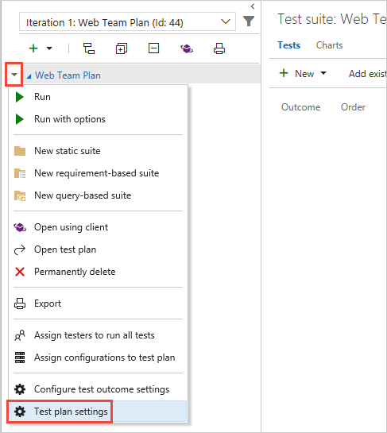

2. In the Test plan settings dialog, select the build pipeline that generates builds which
   contain the test binaries. You can then select a specific build number to test, or let the
   system automatically use the latest build when tests are run.

   

3. You will need a release pipeline that was created from the 
   **Run automated tests from Test Manager** template to run tests from test plans
   in [!INCLUDE [test-hub-include-nolink](includes/test-hub-include-nolink.md)]. If you have an existing release pipeline that was created
   using this template, select it and then select the existing stage in the
   release pipeline where the tests will be executed.
   Otherwise, choose the **Create new** link in the
   dialog to create a new release pipeline containing a single stage
   with the **Visual Studio Test** task already added.

   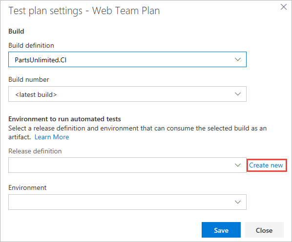

   [How do I pass parameters to my test code from a build or release pipeline?](#pass-params)

4. Assign meaningful names to the release pipeline and stage as required.

5. You need the Visual Studio Test Platform to be installed on the agent computer.
   If Visual Studio is already installed on the agent computer, you can skip this step.
   If not, you must add the [Visual Studio Test Platform Installer task](../pipelines/tasks/test/visual-studio-test-agent-deployment.md)
   to the pipeline definition.

6. Add the [Visual Studio Test task](../pipelines/tasks/test/vstest.md) to the release pipeline and configure it as follows:
 
   * Verify that version 2 of the Visual Studio Test task is selected.
     The version number is shown in the drop-down list at the top left
     of the task settings panel. 

     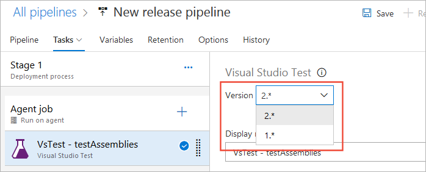 

   * Verify that **Select tests using** is set to **Test run**.
     [What does this setting mean?](#faq-ondemandruns) 

     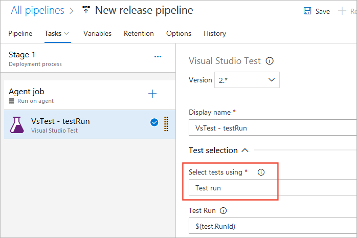 

   * For the **Test platform version** setting, select **Installed by Tools Installer**. 

     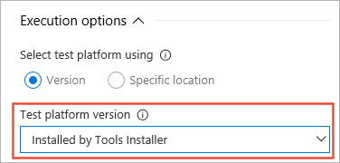 

   * If you have UI tests that run on **physical browsers** or **thick clients**,
     ensure that the agent is set to run as an interactive process with
     auto-logon enabled. Setting up an agent to run interactively must be
     done before queueing the build or release (setting the **Test mix
     contains UI tests** checkbox does not configure the agent in interactive
     mode automatically - it is used only as a reminder to configure
     the agent appropriately to avoid failures).

   * If you are running UI tests on a **headless browser**, the interactive process
     configuration is not required.

   * Select how is the test platform is provisioned, and the version of
     Visual Studio or the location of the test platform that is installed
     on the test machines 

   * If your tests need **input parameters** such as app URLs or database
     connection strings, select the relevant settings file from the
     build artifacts. You can use the **Publish build artifacts** tasks
     in you build pipeline to publish the settings file in a drop
     location if this file is not included in the artifacts.
     In the example shown below, the application URL is exposed in the
     run settings file, and is overridden to set it to a staging URL
     using the **Override test run parameters** setting.

     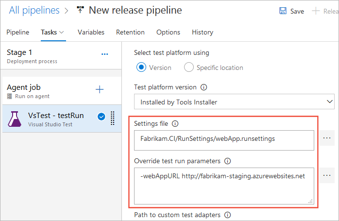

     For information about the option settings of the Visual Studio Test task, see [Visual Studio Test task](https://github.com/Microsoft/azure-pipelines-tasks/blob/master/Tasks/VsTestV2/README.md).

7. Choose the **Agent job** item and verify that the deployment queue
   is set to the one containing the machines where you want to run the
   tests. If your tests require special machines from the agent pool,
   you can add demands that will select these at runtime.

   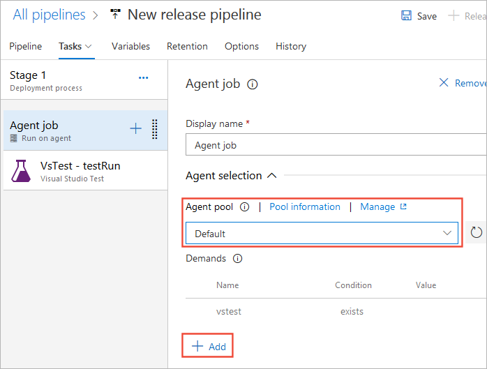

   You may be able to minimize test times by distributing tests across multiple
   agents by setting **Parallelism** to **Multiple executions** and specifying the number of agents.

   > [!NOTE]
   > If you are running UI tests such as CodeUI or Selenium
   > on physical browsers such as IE, Firefox, or Chrome, the agent
   > on the machines must be running in interactive mode and not
   > as a service. [More details](#faq-agentmode). 

8. In the **Pipeline** page of the release pipeline, verify
   that the build pipeline containing the test binaries is linked
   to this release pipeline as an artifact source.  

   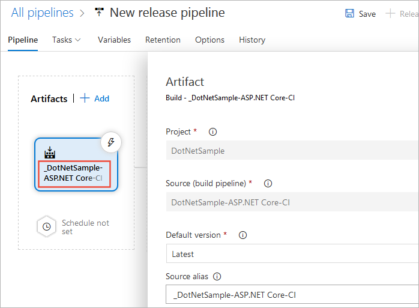
 
9. Save the release pipeline.

10. If you chose **Create new** in the Test plan settings dialog in step 2
    of this example, return to the browser page containing your test plan
    settings. In the Test plan settings dialog, select the release pipeline
    and stage you just saved.

    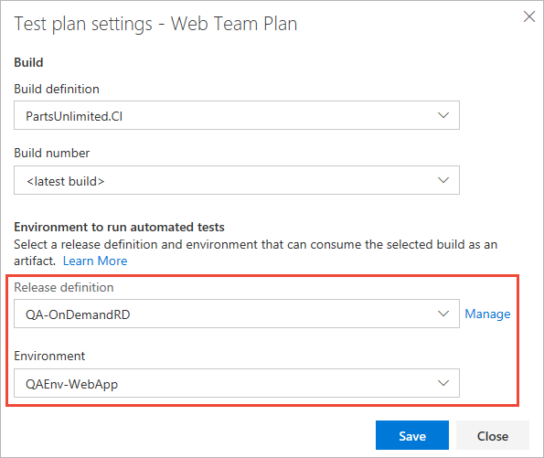

## Run the automated tests

1. In [!INCLUDE [test-hub-include](includes/test-hub-include.md)], open the test plan and select a test suite that contains the
   automated tests.

2. Select the test(s) you want to run, open the **Run** menu,
   and choose **Run test**. 

   

   The test binaries for these tests must be available
   in the build artifacts generated by your build pipeline.

3. Choose **OK** to start the testing process. The system checks that only
   automated tests are selected (any manual tests are ignored),
   validates the stage to ensure the Visual Studio Test
   task is present and has valid settings, checks the user's
   permission to create a release for the selected release
   pipeline, creates a test run, and then triggers the creation
   of a release to the selected stage.

   

4. Choose **View test run** to view the test progress and analyze
   the failed tests. Test results have the relevant information
   for debugging failed tests such as the error message, stack trace,
   console logs, and attachments. 
 
5. After test execution is complete, the **Runs** page of the
   [!INCLUDE [test-hub-include-nolink](includes/test-hub-include-nolink.md)] shows the test results. The **Run summary** page
   shows an overview of the run.

   
 
   There is a link to the **Release** used to run the tests, which
   makes it easy to find the release that ran the tests if you need
   to come back later and analyze the results. Also use this link if you
   want to open the release to view the release logs.

   **Note** : Manually attaching of files is not supported for automated test results.

   [What are the typical error scenarios or issues I should look out for if my tests don't run?](#faq-errors)

6. The **Test results** page lists the results for each test in the
   test run. Select a test to see debugging information for failed
   tests such as the error message, stack trace, console logs, and attachments. 

   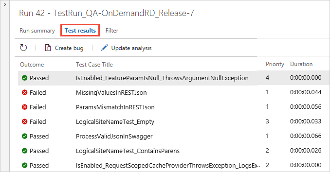

7. Open the **Test Plans** page and select the test plan to see the status
   of your tests if tests are updated after test execution is complete.
   Select a test to see the recent test results.

   

## FAQ

### Q: What permissions do I need to run automated tests from Azure Test Plans?

You must be a Project Contributor, or have the following permissions:

* Create releases
* Manage releases
* Edit release stage
* Manage deployment

For more information, see [Set permissions for release pipelines](../pipelines/policies/set-permissions.md) and
[Release permissions](../pipelines/policies/permissions.md#release-permissions).

### Q: Can I override the build or stage set at the test plan level for a specific instance of test run?

**A:** Yes, you can do this using the **Run with options** command.
Open the shortcut menu for the test suite in the left column and choose
**Run with options**.

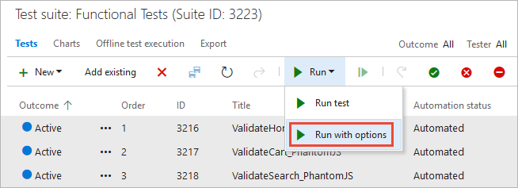

Enter the following values in the Run with options dialog and then choose **OK**:

* **Test type and runner**: Select **Automated tests using Release Stage**.
  
* **Build**: Select the build that has the test binaries. The test results will be associated this build.
 
* **Release Pipeline**: Select a pipeline from the list of release pipelines that can consume the selected build artifact.
 
* **Release Stage**: Select the name of the stage configured in your release pipeline.

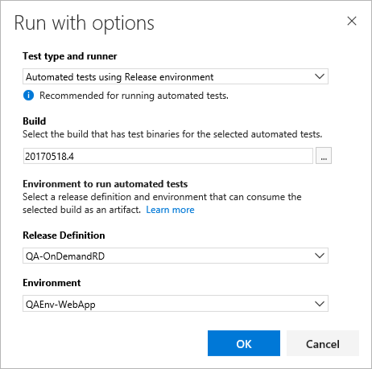

### Q: Why use release stages to run tests? 

**A:** Azure Pipelines offers a compelling orchestration workflow
to obtain test binaries as artifacts and run tests. This workflow shares
the same concepts used in the scheduled testing workflow, meaning users
running tests in scheduled workflow will find it easy to adapt; for 
example, by cloning an existing scheduled testing release pipeline.

Another major benefit is the availability of a rich set of tasks in
the task catalog that enable a range of activates to be performed before
and after running tests. Examples include preparing and cleaning test data,
creating and cleaning configuration files, and more.

### Q: How does selecting "Test run" in the Visual Studio Test task version 2 work?

**A:** The Test management sub-system uses the test run object to
pass the list of tests selected for execution. The test task looks
up the test run identifier, extracts the test execution information
such as the container and test method names, runs the tests, updates
the test run results, and sets the test points associated with the
test results in the test run. From an auditing perspective, the 
Visual Studio task provides a trace from the historical releases
and the test run identifiers to the tests that were submitted for
on-demand test execution.

### Q: Should the agent run in interactive mode or as a service?

**A:** If you are running UI tests such as
[coded UI](/visualstudio/test/use-ui-automation-to-test-your-code)
or [Selenium](../pipelines/test/continuous-test-selenium.md) tests,
the agent on the test machines must be running in interactive mode with auto-logon enabled,
not as a service, to allow the agent to launch a web browser.
If you are using a headless browser such as [PhantomJS](https://phantomjs.org/),
the agent can be run as a service or in interactive mode. See 
[Build and release agents](../pipelines/agents/agents.md),
[Deploy an agent on Windows](../pipelines/agents/v2-windows.md),
and [Agent pools](../pipelines/agents/pools-queues.md).

### Q: Where can I find detailed documentation on how to run Selenium tests?

**A:** See [Get started with Selenium testing](../pipelines/test/continuous-test-selenium.md).

### Q: What happens if I select multiple configurations for the same test?

**A:** Currently, the on-demand workflow is not configuration-aware.
In future releases, we plan to pass configuration context to the test
method and report the appropriate results.

### Q: What if I need to download product binaries and test binaries from different builds? Or if I need to obtain artifacts from a source such as Jenkins?

**A:** The current capability is optimized for a single team build
to be tested on-demand using an Azure Pipelines workflow.
We will evaluate support for multi-artifact releases, including
non-Azure Pipelines artifacts such as Jenkins, based on user feedback.

### Q: I already have a scheduled testing release pipeline. Can I reuse the same pipeline to run test on-demand, or should I create a new pipeline as shown above? 

**A:** We recommend you use a separate release pipeline and stage for on-demand automated testing from Azure Test Plans because:

* You may not want to deploy the app every time you want to run a few on-demand tests.
Scheduled testing stages are typically set up to deploy the product and then run tests.

* New releases are triggered for every on-demand run. If you have many
testers executing a few on-demand test runs every day, your scheduled
testing release pipeline could be overloaded with releases for these
runs, making it difficult to find releases that were triggered for the
pipeline that contains scheduled testing and deployment to production.

* You may want to configure the Visual Studio Test task with a Test run
identifier as an input so that you can trace what triggered the release.
See [How does selecting "Test run (for on-demand runs)" in the Visual Studio Test task work?](#faq-ondemandruns).

### Q: Can I trigger these runs and view the results in Microsoft Test Manager?

**A:** No. Microsoft Test Manager will not support running automated tests against Team Foundation
builds. It only works in the web-based interface for Azure Pipelines and TFS.
All new manual and automated testing product development investments will be
in the web-based interface. No further development is planned for Microsoft Test Manager. See
[Guidance on Microsoft Test Manager usage](/previous-versions/azure/devops/test/mtm/guidance-mtm-usage).

### Q: I have multiple testers in my team. Can they run tests from different test suites or test plans in parallel using the same release pipeline?

**A:** They can use the same release pipeline to trigger multiple
test runs in parallel if:

* The agent pool associated with the stage has sufficient agents
to cater for parallel requests. If sufficient agents are not available,
runs can still be triggered but releases will be queued for processing
until agents are available.

* You have sufficient jobs to enable parallel jobs.
See [Parallel jobs in Azure Pipelines](../pipelines/licensing/concurrent-jobs.md) 
or [Parallel jobs in TFS](../pipelines/licensing/concurrent-pipelines-tfs.md) for more information.

* Testers do not run the same tests in parallel. Doing so may cause
results to be overwritten depending on the order of execution.

To enable multiple different test runs to execute in parallel, set the Azure Pipelines stage trigger option for
[behavior when multiple releases are waiting to be deployed](../pipelines/release/triggers.md#env-triggers)
as follows:

* If your application supports tests running in parallel from different
sources, set this option to
**Allow multiple releases to be deployed at the same time**.

* If your application does not support tests running in parallel
from different sources, set this option to
**Allow only one active deployment at a time**.

### Q: How do I pass parameters to my test code from a build or release pipeline?

A: Use a [runsettings](https://docs.microsoft.com/visualstudio/test/configure-unit-tests-by-using-a-dot-runsettings-file)
file to pass values as parameters to your test code. For example, in a release that contains several stages,
you can pass the appropriate app URL to each the test tasks in each one. The runsettings file and matching parameters
must be specified in the [Visual Studio Test task](../pipelines/tasks/test/vstest.md). 

### Q: What are the typical error scenarios or issues I should look out for if my tests don't run?

**A:** Check and resolve issues as follows:

* The release pipeline and stage in which I want to run tests
  are not shown after I select the build.
   - Make sure the build pipeline that is generating the build is linked
     as the primary artifact in the **Artifacts** tab of the release pipeline.

 
* I get an error that I don't have sufficient permission to trigger a release.
   - Configure **Create releases** and **Manage deployments** permissions for
     the user in the **Security** menu of the release pipeline.
     See [Release permissions](../pipelines/policies/permissions.md#release-permissions).

   
* I get an error that no automated tests were found.
   - Check the automation status of the selected tests. Do this in the work item
     for the test case, or use the **Column options** link in **Azure Test Plans**
     to add the **Automation status** column to the list
     of tests. See the [pre-requisites section](run-automated-tests-from-test-hub.md#prerequisites) for information
     about automating manual tests.

* My tests didn't execute, and I suspect the release pipeline is incorrect.
   - Use the link in the **Run summary** page to access the release instance
     used to run the tests, and view the release logs.
 

* My tests go into the error state, or remain "in-progress" even after release to the stage is triggered.
   - Check if the release stage that you selected has the correct task
     and version selected. You must use version 2 or higher of the **Visual Studio
     Test** task. Version 1 of the task, and the **Run Functional Tests** task,
     are not supported.
 

## See Also

* [Associate automated tests with test cases](associate-automated-test-with-test-case.md)
* [Associate automated test results with requirements](associate-automated-results-with-requirements.md)
* [Continuous testing scenarios and capabilities](index.yml)

[!INCLUDE [help-and-support-footer](includes/help-and-support-footer.md)] 
