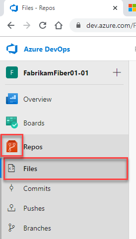
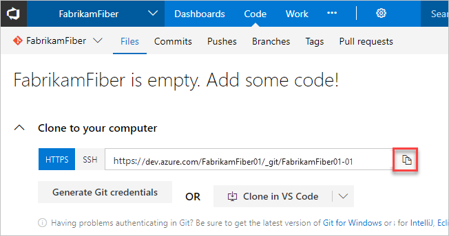

# Quickstart: Code with Git

[!INCLUDE [temp](../includes/version-vsts-tfs-all-versions.md)]

In this quickstart, learn how to share your code with others. After you create a new organization and project in Azure DevOps, you can begin coding with Git.

To work with a Git repo, you clone it to your computer. Cloning a repo creates a complete local copy of the repo for you to work with. Cloning also downloads all [commits](../repos/git/commits.md) and [branches](../repos/git/branches.md) in the repo, and sets up a named relationship with the repo on the server. Use this relationship to interact with the existing repo, pushing and pulling changes to share code with your team.

## Install Git command-line tools

1. Install one of the following Git command-line tools:

   - To install Git for Windows, including Git Credential Manager, see [Install the Git Credential Manager](../repos/git/set-up-credential-managers.md).
   - To install on macOS or Linux, check out the [Installing Git](https://git-scm.com/book/en/v2/Getting-Started-Installing-Git) chapter in the open-source _Pro Git_ book. For macOS and Linux, we recommend [configuring SSH authentication](../repos/git/use-ssh-keys-to-authenticate.md)

## Clone the repo to your computer

::: moniker range=">= azure-devops-2019"

1. From your web browser, open the project for your organization, and select **Repos**. If you don't have a project, [create one now](sign-up-invite-teammates.md).

   

2. Select **Clone** in the upper-right corner of the Code window, and copy the URL.
  
   

3. Open the Git command window (Git Bash on Git for Windows). Go to the folder where you want the code from the repo stored on your computer, and run `git clone`, followed by the path copied from **Clone URL** in the previous step. See the following example:

   ```
   git clone https://FabrikamFiber01@dev.azure.com/FabrikamFiber01/FabrikamFiber01-01/_git/FabrikamFiber01-01
   ```
  
   A copy of the code is downloaded in Git, including all [commits](../repos/git/commits.md) and [branches](../repos/git/branches.md) from the repo. This copy is put into a new folder for you to work with.

   Keep this command window open, as you'll use it in the following steps).

::: moniker-end

::: moniker range="<= tfs-2018"

1. From your web browser, open the project for your organization, and select **Code**. If you don't have a project, [create one now](sign-up-invite-teammates.md).

2. Select **Clone** in the upper-right corner of the Code window, and copy the URL.

   

3. Open the Git command window (Git Bash on Git for Windows). Go to the folder where you want the code from the repo stored on your computer, and run `git clone`, followed by the path copied from **Clone URL** in the previous step. See the following example:

   ```
   git clone https://contoso-ltd.visualstudio.com/MyFirstProject/_git/contoso->demo
   ```
  
   A copy of the code downloads into a new folder in Git. The code includes all of your [commits](../repos/git/commits.md) and [branches](../repos/git/branches.md) from the repo.

   Keep the command window open (use it in the following steps).

::: moniker-end

## Work with the code

In the following steps, we make a change to the files on your computer, commit the changes locally, and push the commit to the repo stored on the server. We can then view the changes.

1. Browse to the folder on your computer where you cloned the repo, open the `README.md` file in your editor of choice, and make some changes. Then save and close the file.

2. In the Git command window, go to the `contoso-demo` directory by entering the following command:

   ```
   cd contoso-demo
   ```

3. Commit your changes by entering the following commands in the Git command window:

   ```
   git add .
   git commit -m "My first commit"
   ```

   The `git add .` command stages any new or changed files, and `git commit -m` creates a commit with the specified commit message.

4. Push your changes to the Git repo on the server. Enter the following command into the Git command window:

   ```
   git push
   ```

## View history

::: moniker range=">= azure-devops-2019"

1. Switch back to the web portal, and select **History** from the Code page to view your new commit.

   

2. Switch to the **Files** tab, and select the README file to view your changes.

   

::: moniker-end

::: moniker range="<= tfs-2018"

1. Switch back to the web portal, and select **History** from the **Code** tab to view your new commit. Two commits appear: the first commit, where the README and .gitignore were added upon repo creation, and the commit you just made.

   

2. Switch to the **Files** tab, and select the README file to view your changes.

     

::: moniker-end

## Next steps  

> [!div class="nextstepaction"]
> [Set up continuous integration & delivery](../pipelines/create-first-pipeline.md?bc=%252fazure%252fdevops%252fuser-guide%252fbreadcrumb%252ftoc.json&toc=%252fazure%252fdevops%252fuser-guide%252ftoc.json)